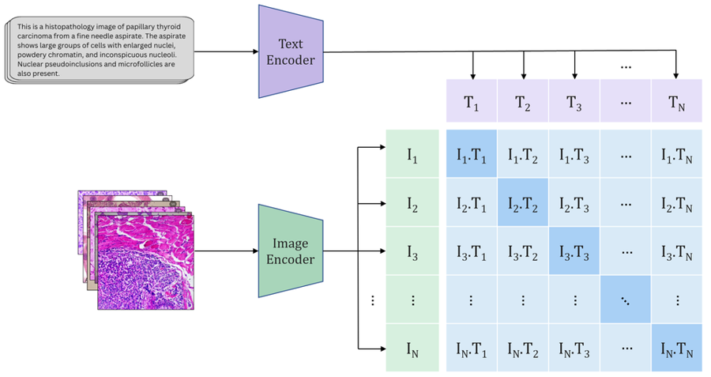

# IP-CLIP (IPATH): Clean, Reproducible Code

**TL;DR** — Minimal, readable pipeline for training and evaluating **IP-CLIP**, a CLIP model fine-tuned on the **IPATH** histopathology image–caption dataset (sourced from Instagram). Includes **zero-shot classification** and **linear probing** on external pathology datasets.

<p align="center">
  
</p>

## Highlights

- Simple **CLIP encoder** wrapper for images & text  
- **Fine-tuning** a linear head on CLIP image features (IP-CLIP)  
- **Zero-shot** classification and **linear probing** evaluation scripts  
- Clean metrics and CSV-based dataset interface

> Reported in our paper:  
> **Zero-shot F1**: 0.40–0.71 (vs. baseline 0.19–0.31)  
> **Linear probe F1**: 0.89–0.91 (vs. baseline 0.73–0.85)

---

## Installation

```bash
python -m venv .venv
# Linux/macOS
source .venv/bin/activate
# Windows
# .venv\Scripts\activate

pip install torch torchvision torchaudio --index-url https://download.pytorch.org/whl/cu121  # choose the right CUDA/CPU wheel
pip install numpy pandas scikit-learn pillow tqdm
pip install git+https://github.com/openai/CLIP.git
```

---

## Dataset

**IPATH (image–caption pairs):** https://zenodo.org/records/14278846

This repo expects simple CSVs for experiments:

- **Zero-shot** CSV columns:
  - `image` — absolute path to the image file  
  - `label` — ground-truth class string
- **Linear probing / Fine-tuning** CSV columns:
  - `image` — absolute path to the image file  
  - `label` — class label (string or numeric)

Adapt your preprocessing to emit this format if needed.

---

## Quickstart

### Zero-shot classification

```bash
python scripts/eval_zero_shot.py   --images_csv /path/to/Kather_test.csv   --labels "adipose tissue" "background" "debris" "lymphocytes" "mucus"           "smooth muscle" "normal colon mucosa" "cancer-associated stroma"           "colorectal adenocarcinoma epithelium"
```

### Linear probing (frozen CLIP features)

```bash
python scripts/eval_linear_probe.py   --train_csv /path/to/Kather_train.csv   --test_csv  /path/to/Kather_test.csv   --alpha 0.001
```

### Fine-tuning a linear head on CLIP (IP-CLIP)

```bash
python scripts/finetune_ipclip.py   --num_classes 9   --train_csv /path/to/Kather_train.csv   --val_csv   /path/to/Kather_test.csv   --epochs 5 --batch_size 8 --lr 5e-5
```

---

## Repository Structure

```
ipclip/
  embedders.py     # CLIP load + image/text encoders
  datasets.py      # minimal PyTorch datasets
  transforms.py    # train/eval transforms
  scheduler.py     # warmup + cosine LR
  finetune.py      # FineTuner (linear head on CLIP features)
  linear_probe.py  # sklearn SGDClassifier probe
  zero_shot.py     # zero-shot prediction/eval
  retrieval.py     # simple retrieval utils (optional)
  metrics.py
  caching.py       # optional small .npy cache
  utils.py         # append results to CSV

scripts/
  finetune_ipclip.py
  eval_zero_shot.py
  eval_linear_probe.py

docs/
  images/
    fig-arch-small.png  # place the architecture figure here
```

> To display the architecture image in the README, place your file at  
> `docs/images/fig-arch-small.png` (or update the `` path above).

---

## Cite

If you use this repository or the IPATH dataset, please cite our paper:

```bibtex
@inproceedings{10.1117/12.3051527,
author = {S. Mirhosseini and T. Rai and P. Diaz-Santana and R. La Ragione and N. Bacon and K. Wells},
title = {{The IPATH dataset: training CLIP models with histopathology-based image-caption pairs from Instagram}},
volume = {13413},
booktitle = {Medical Imaging 2025: Digital and Computational Pathology},
editor = {John E. Tomaszewski and Aaron D. Ward},
organization = {International Society for Optics and Photonics},
publisher = {SPIE},
pages = {1341319},
keywords = {Digital Pathology, Multimodal AI, Image-Text Datasets, Social Media, Zero-shot Classification, Foundation Models, Instagram, GPT-4o mini},
year = {2025},
doi = {10.1117/12.3051527},
URL = {https://doi.org/10.1117/12.3051527}
}
```

**Dataset:** https://zenodo.org/records/14278846

---

## License

MIT License (see `LICENSE`).

---

## Acknowledgments

Built on OpenAI **CLIP** and standard PyTorch/Scikit-learn tooling. Thanks to the pathology community and collaborators who supported dataset curation and evaluation.
